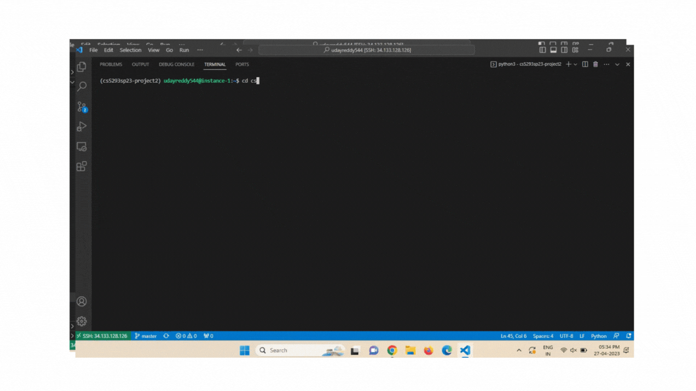
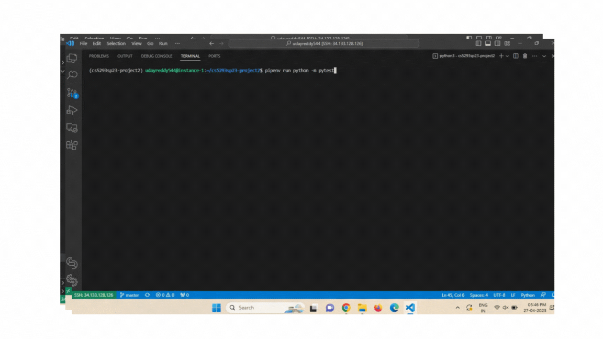

## An application that has been built using the ML models (like clustering, supervised) and pickle library which is used to predict the cuisine according to the ingredients given through the command line interface.
## Prediction of receipe  
##### Installation  
pyenv install 3.10.1  
pyenv global 3.10.1  
pip install --upgrade pip  
##### Running  
- pipenv shell
- python project2.py --N 5 --ingredient rice --ingredient banana
- pipenv run python -m pytest (to run test cases)
#### Packages   
- pytest
- scikit-learn
- pandas
- numpy
#### Folders
- tests --contains the test file "test_functions.py"
#### Recording

#### Recording for Test Functions

#### Tree structure 

#### Assumptions and Considerations
I didn't use the test train split in this project as I collecting the whole data from the command line arguements from the user, so I am using the whole data for the training the model of machine learning.
I didn't use any clustering algorithm for this project as clustering algorithms are generally not used for the classifying purpose,but they are used for grouping the similar things , so that it is useful for further analysis.so, I have use the logistic regression classifier as classifier classifies the data into labels.
I have TFidf vectorizer to vectorize the data and later used for fitting purpose.

#### Issues Expected

- yummly.json should be there in folder  cs5293sp23-project2 folder, otherwise the project won't run.please include the yummly.json file in folder before running.

- When giving the ingriedient name with word between space, we should use quotes like "rice Krispies"

- The program is taking around 30 seconds to run.
#### Important Files
- project2.py --contains the two functions that performs loading,vectorization, fitting ,finding scores and the formatting the output in json.

#### Functions in Project2.py

##### load_prepare_vectorize_data(test_data,top_n_items)

test_data= input of ingredients collected from command line arguements as a form of list
top_n_items=The number of closest predicted cuisines collected form the command line arguements.
The function does the things like loading the json file and thereafter the data is loaded into the data frame, the ingriedients column from the data is vectorized, as remaining columnms are not important as the ingredients column.I used the data from the cuisine column, this columns are used as labels to classify the data.
This function also uses the cosine similarity find the n+1 closer scores and stores the output in dictionary.
I calculated top predicted as top element with more score, and stored the cuisine into predicted cuisine as it's easy to iterate the dictionary.
The function returns top predicted cuisine and dictionary that next n closer predictions.
This values are passed to format_output function.

##### format_output(predicted_cuisine,output_dict)

predicted_cuisine -- cuisine that is predicted and calculated using the cosine similarity
output_dict- dictionary that contains the id's of the cuisines and their particular scores that calculate in load_prepare_vectorize_data() function.

This function formats the output using the json.dumps() function with some indentation.
and returns the output.

The function returns the output in format of json.

#### Testing
- folder -tests
- file name- test_functions.py
- library used -pytest

##### functions in test_functions.py

###### test_load_prepare_vectorize_data_positive():

This function tests the functionality of load_prepare_vectorize_data(test_data,top_n_items) in project2.py
The parameters are hard coded as:
- test_data=['rice']
- top_n_items=2

###### test_format_output():

This function tests the functionality of format_output(predicted_cuisine,output_dict) function in project2.py
The parameters are hardcoded as :
- predicted_cuisine="japanese"
- output_dict={44076: 0.7636428981435683, 21333: 0.7011572019101071, 15180: 0.6572830447330928, 15448: 0.6209323715286515, 12082: 0.5917865975091795, 46714: 0.5887853530954195}

###### test_vectorize():

This function tests the vectorization part in load_prepare_vectorize_data(test_data,top_n_items) and sees whether the data is generated.
The hardcode parameters used are:
test_data=['rice','banana']

###### test_similarity():

The function tests the cosine similarity part used in load_prepare_vectorize_data(test_data,top_n_items) and sees whether the data is generated.
The hardcode parameters used are:
test_data=['rice','banana']

